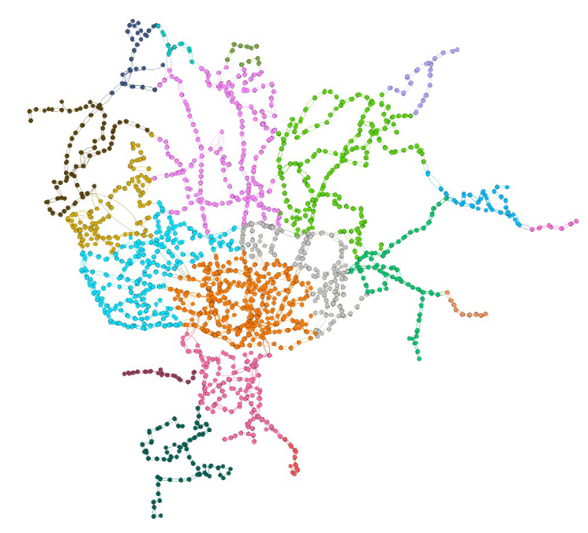

# FEUP-AED-PROJ2

## Second project for the AED course unit at FEUP.

    

The main task of this work is to implement a system capable of providing help to those who you want to use the STCP network to move around.

This project was made with [Mariana Lobao](https://github.com/marineve17) and [Andre Lima](https://github.com/limwa).

## Building

This project uses [cmake](https://cmake.org/). Assuming it's installed and properly setup, simply run `cmake -S . -B build` in this project's directory to generate the build system, then `cmake --build build` to actually build the project.

This will generate one binary in the `build` directory, `stcp`, that uses [ANSI escape codes](https://en.wikipedia.org/wiki/ANSI_escape_code).

Additionally, documentation will also be generated in the `docs` folder. Run `git submodule init` then `git submodule update` then build again to get the documentation website looking fancy.

## Running

Simply run the executable generated in the last section.

The UI is fairly intuitive and lets you choose the stops, the lines the distance you are willing to walk and the parameter you want to be taken into account when choosing your path.

## Unit info

* **Name**: Algoritmos e Estruturas de Dados (Algorithms and Data Structures)
* **Date**: Year 2, Semester 1, 2021/22
* [**More info**](https://sigarra.up.pt/feup/ucurr_geral.ficha_uc_view?pv_ocorrencia_id=484404)

## Disclaimer

This repository (and all others with the name format `feup-*`) are for archival and educational purposes only.

If you don't understand some part of the code or anything else in this repo, feel free to ask (although I may not understand it myself anymore).

Keep in mind that this repo is public. If you copy any code and use it in your school projects you may be flagged for plagiarism by automated tools.
